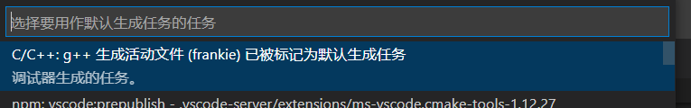
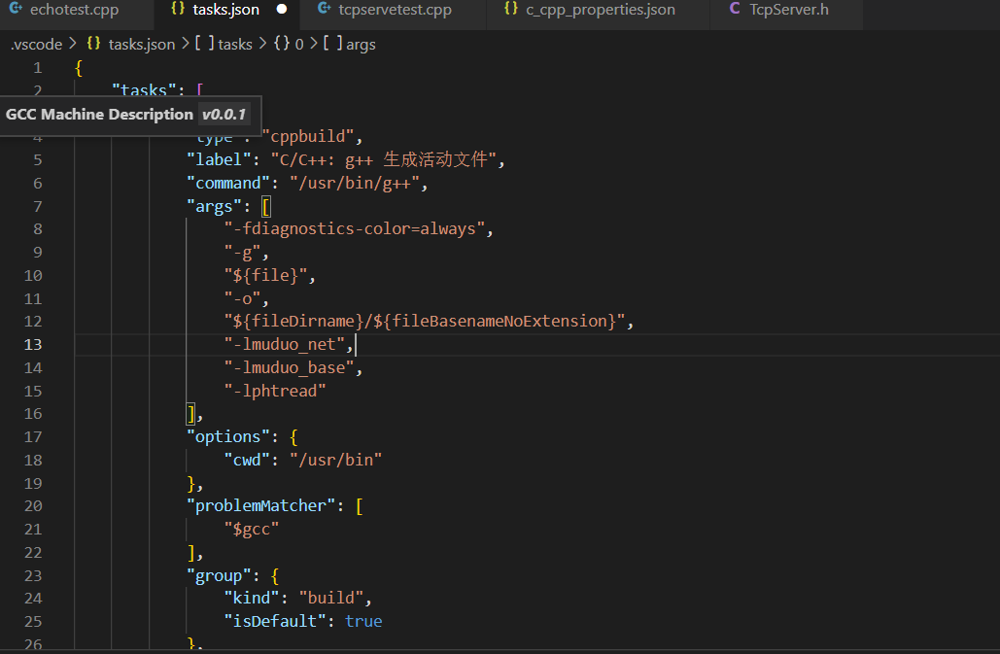

# 使用 MUDUO库

https://dandelioncloud.cn/article/details/1524349613712904193

##### 安装BOOST环境

https://blog.csdn.net/QIANGWEIYUAN/article/details/88792874

包括WIN下的VSSTUDIO的BOOST库按爪给你与使用

 	LINUX下的BOOST库安装与使用

##### 安装MUDUO库

https://blog.csdn.net/QIANGWEIYUAN/article/details/89023980/

我把静态库文件放在了/usr/local/bin下。 头文件在~/mylib/muduo/lib

把头文件放在了/usr/bin/inlucde下

然后VSCODE里面的路径是识别头文件的路径而已

##### 在VSCODE中加入静态库/动态库

在g++  build  配置默认生成的任务

