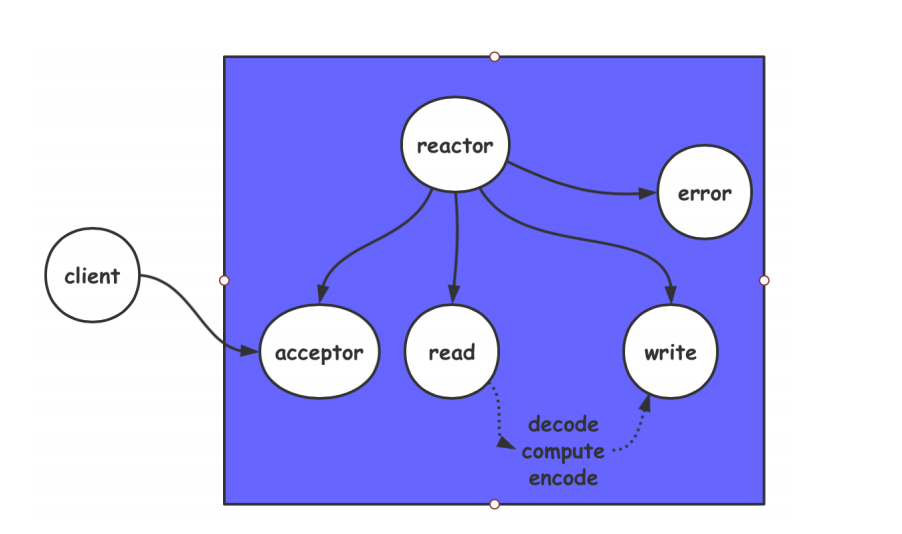

# Reactor设计模式


Reactor模式中，要求主线程（I/O处理单元）只负责监听文件IO（文件描述符）上是否有事件发生（虽然还可以监听信号，定时事件，但不采用）。有的话将其加入就绪队列，一旦有空闲的工作线程，工作线程处理事件（如读写数据，接收新的连接，以及处理客户请求）。


{

就绪事件和工作线程是位于逻辑单元里的。

注册写就绪事件和读就绪事件 不是 读数据，写数据。注册写事件是表明如IO文件可读，这就是一个事件，我将它通知注册。

}


**reactor从原来的对io处理改为对事件处理**


##### 重要组件

1.Event事件  2.Reactor反应堆   3.Demultiplex事件分发器   4.Eventhandler事件处理器


Reactor相当于一个监听器，Event向Reactor注册事件和处理函数，Reactor维护了事件（Event）和事件处理函数（handler）的集合。

Demultiplex相当于一个复用IO接口，我们看作epoll，启动分发器就是启动事件循环epoll_wait()。

 然后如果有一个事件响应返回，那么分发器就将该事件event返回给Reactor（因为对应的handler只在反应堆Reactor中维护），然后Reactor再找到Eventhandler调用具体的handler。





##### 为什么Reactor要使用非阻塞io？

基础推理点中有回答

##### 架构实现

```cpp
#include <stdio.h>
#include <sys/epoll.h>


#define IP ""
#define PORT 0000
struct sockitem
{
    int sockfd;
    int (*callback)(int fd,int event,void * arg);
 
    char recvbuffer[1024]; //or  char* ,处理粘包 
    char sendbuffer[1024];
    int rlen;
    int slen;
}


struct Reactor //反应堆结构
{
    int epfd;
    struct epoll_event events[512];
}
Reactor * eventloop = nullptr; 


int accept_cb(int fd,int events,void * arg){
    //lfd回调处理
    struct sockaddr_in client_addr;
	memset(&client_addr, 0, sizeof(struct sockaddr_in));
	socklen_t client_len = sizeof(client_addr);
	
	int clientfd = accept(fd, (struct sockaddr*)&client_addr, &client_len);
	if (clientfd <= 0) return -1;

	char str[INET_ADDRSTRLEN] = {0};
	printf("recv from %s at port %d\n", inet_ntop(AF_INET, &client_addr.sin_addr, str, sizeof(str)),
		ntohs(client_addr.sin_port));

	struct epoll_event ev;
	ev.events = EPOLLIN | EPOLLET;
	//ev.data.fd = clientfd;

    //重点
	struct sockitem *si = (struct sockitem*)malloc(sizeof(struct sockitem));
	si->sockfd = clientfd;
	si->callback = recv_cb;  
	ev.data.ptr = si;
	epoll_ctl(eventloop->epfd, EPOLL_CTL_ADD, clientfd, &ev);
	
	return clientfd;
}

int recv_cb(int fd,int events,void * arg){
    // int ret = recv(fd, si->recvbuffer, BUFFER_LENGTH, 0);
	if (ret < 0) {   //while(ret < 0  )  具体看用哪种看具体场景
    
			
	}
    else if( ret == 0) {

        //下树，close,free资源

    }

    else{

        //cfd业务逻辑

    }
    
    
}

int send_cb(int fd,int events,void * arg){
    //同recv_cb;
}


int main(int argc ,char * argv[])
{
    if(argc < 2 ) return -1;

    int lfd = tcpbind4(IP,PORT);  //创建socket,绑定socket

    // 1.创建反应堆句柄 以及 反应堆。句柄需要共享，分配到堆。并初始化;
    eventloop = (struct Reactor *)malloc(sizeof(struct Reactor));
    eventloop->epfd = epoll_creat(1);

    struct sockitem * si = (struct sockitem*)malloc(sizeof(struct sockitem));
    si->sockfd = lfd; si->callback=accept_cb;                                       //注册lfd以及cb

    struct epoll_event ev;
    ev.events=EPOLLIN; ev.data.ptr = si;                                           //注册lfd事件


    epoll_ctl(eventloop->epfd,EPOLL_CTL_ADD,lfd,&ev);                               //Reactor中注册
    


    // 2.启动反应堆 (这是单线程模式，多线程应该分离lfd与cfd)
    while(1){
        int nready = epoll_wait(eventloop->epfd, eventloop->events, 512, -1);
		if (nready < -1) {
            break;
        }
		

        for(int i=0 ;i <nready; i ++ ){
        	if (eventloop->events[i].events & EPOLLIN) {
				struct sockitem *si = (struct sockitem*)eventloop->events[i].data.ptr;
				si->callback(si->sockfd, eventloop->events[i].events, si);
			}

            if (eventloop->events[i].events & EPOLLOUT) {
				struct sockitem *si = (struct sockitem*)eventloop->events[i].data.ptr;
				si->callback(si->sockfd, eventloop->events[i].events, si);
			}

        }

    }

}
```


 
