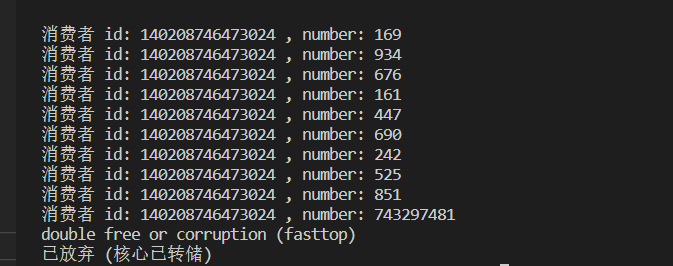
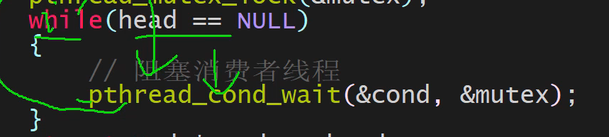
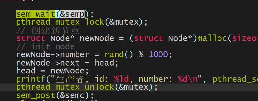
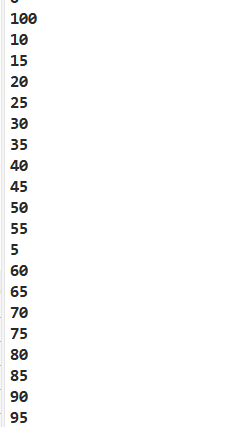

##### 多线程为什么回出现不同步的问题？

多线程不同步出现的问题：**线程/（进程）是有时间片的，当一个线程1写数据，寄存器没来得及将数据写回到内存**，时间片结束，而另外一个线程2开始接着读却读的不是线程1最新更新的值，造成了重复计算。

故线程同步：保证数据从寄存器写回内存，以达到同步

##### 解决线程同步问题

解决线程同步:互斥锁，条件变量+互斥锁，读写锁，信号量

##### 为什么要使用条件变量？

为什么要使用条件变量？首先条件变量只是为了让线程阻塞而不能让线程同步，只有配合锁才能达到同步。那么条件变量用来干嘛？比如生产者消费者模型，如果生产者将队列生产满了，那么不应该继续生产，这时如果不阻塞将消耗CPU做无用功，如果阻塞选择sleep，你不知道时间所以这个时间是不定的，不利于线程生产。所以用条件变量，当队列有位置时提醒生产者，阻塞时间刚好，告诉生产者们可以继续生产了

条件变量是用来阻塞的，互斥锁是用来同步的。同步是为了让Register更改的数据能够回到内存而不让其他线程进来在回到之前将数据改变，以造成重复计算。

显然若没有条件变量会造成程序崩溃，这里就是消费者过度消费（即到底了还要继续消费） 这里就需要条件变量。

还有可能是两个消费者抢一个产品抢到的消费者会free，最后必有一个消费者会free一个野指针造成进程崩溃 这里就需要互斥锁同步。

所以生产和消费这个过程需要同步。    其次生产消费不能过度，过度就要阻塞

cond_wait会把锁打开，然后进来的消费者线程会被阻塞在cond_wait，此时互斥锁依然是打开的，不然生产者就会死锁无法提醒任何阻塞的消费者。

唤醒的消费者再次while循环，发现head不是NULL开始抢锁mutex，谁到了则继续向下，没有抢到的将会被继续锁住，当向下执行完后抢到的消费者会开锁，那么阻塞的线程会继续抢锁，若发现head==NULL，那么依然会执行前面的过程，即阻塞在cond_wait，然后cond_wait开锁，生产者唤醒消费者，消费者抢锁。这也是为什么要用while 而不能用if。

生产者和消费者不能使用相同的条件变量，生产者需要队列不为满，消费者是队列不为空，相互彼此唤醒对方。

//可以达到条件变量的效果，更简单。但是如果数据大于1仍然不能达到同步，需要互斥量

//信号量是动态相互提醒，条件变量是边缘相互提醒

//信号量与条件变量一样，两边各有各的信号量（触发媒介）

当数量大于1的时候，sem信号量同样要与mutex配合达到线程同步和 适当阻塞的效果

信号量与mutex必须是这种顺序。否则可能会产生死锁。

死锁：加锁之后忘记解锁（保证退出线程return前释放锁），重复加锁 ，多个资源不当顺序加锁，

线程安全： 死锁问题， 对象可能会在别的线程中销毁（weakptr,sharedptr联合解决）

##### 线程池

销毁工作在工作线程，决定是否销毁在管理线程，用户可以调用线程池销毁，那么所有工作线程都在自己的worker函数里面销毁，每个线程都调用worker线程。所以工作线程的函数worker要自己能够判断需不需要自毁。

管理线程就做一件事每隔几秒判断是加线程还是减线程

线程池的高并发性能在于每个线程调用自己的func，然而高并发带来了副作用，就是入队出队等操作不安全需要加锁，并且多线程不好控制队列的大小，故要条件变量阻塞和唤醒。但是高并发主要输出点在func。

**加锁后，看哪些是临界区，其他有临界区的代码都不能进行下去**

**判断一个变量是否线程安全，就要看它要代表什么意义，哪些地方能改变？这个变量如果不要锁的情况下，其他地方的代码区能不能改变这个变量所表达的真实意义？若能改变就是不安全需要加锁，若不能就是安全的。**

##### 线程秘诀：

1.加锁后，相关的临界区都不能动了，此时可以以顺序执行的思想去写逻辑。

2.判断某代码区是否安全，看该代码处于的环境（锁环境/无环境），里面的临界资源，这个临界资源现在表示什么意思？ 是否能被其他地方改变？若能其改变则判断是否会影响现在的临界区的逻辑正确？

3.条件变量是阻塞，用while+条件。参考系是唤醒执行者。

openssl des3 -d -pbkdf2 -k 630db421 -in ~/lab_dir/dest/expfile.tar.gz  | tar xzvf -

第一题

mv ~/lab_dir/src/A/B/C/passwd{0..100..5}.txt  ~/lab_dir/src/A/ 

第二题

wc -l ~/lab_dir/src/A/B/C/*.txt |sort -h

第三题

ls | awk '/^passwd.*/{print $0}' |awk -F "[d.]" '{print $2}'| sort -h | awk '{printf "passwd%d.txt\n",$0}' > /home/frankie/lab_dir/dest/sortfile

第四题

cat /home/frankie/lab_dir/dest/sortfile | grep -E "*" > /home/frankie/lab_dir/dest/trfile && rm /home/frankie/lab_dir/dest/sortfile

第五题

sudo mkdir /home/frankie/lab_dir/dest/res

sudo mv ./A/*.txt ./A/B/C/*.txt /home/frankie/lab_dir/dest/res

cd ~/lab_dir/src && rm -R ./A