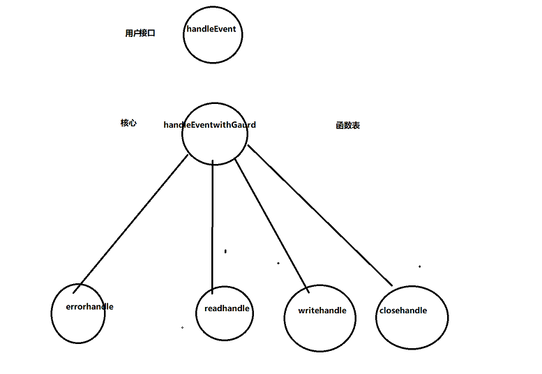
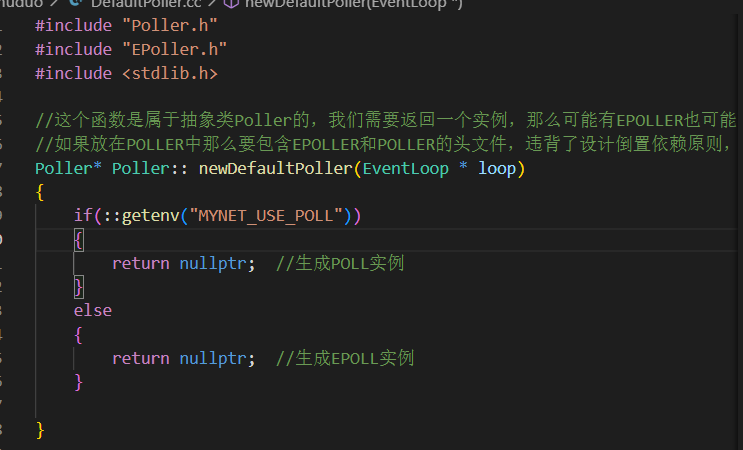
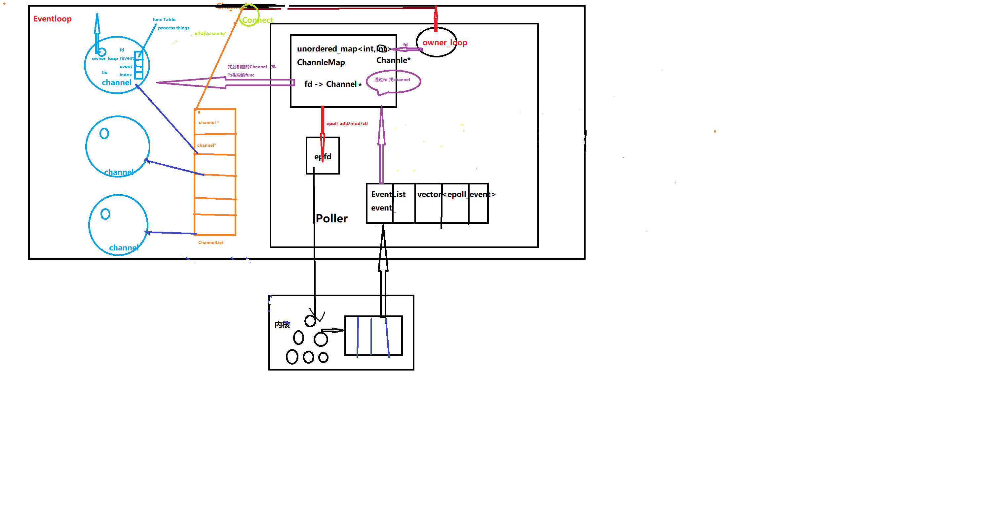
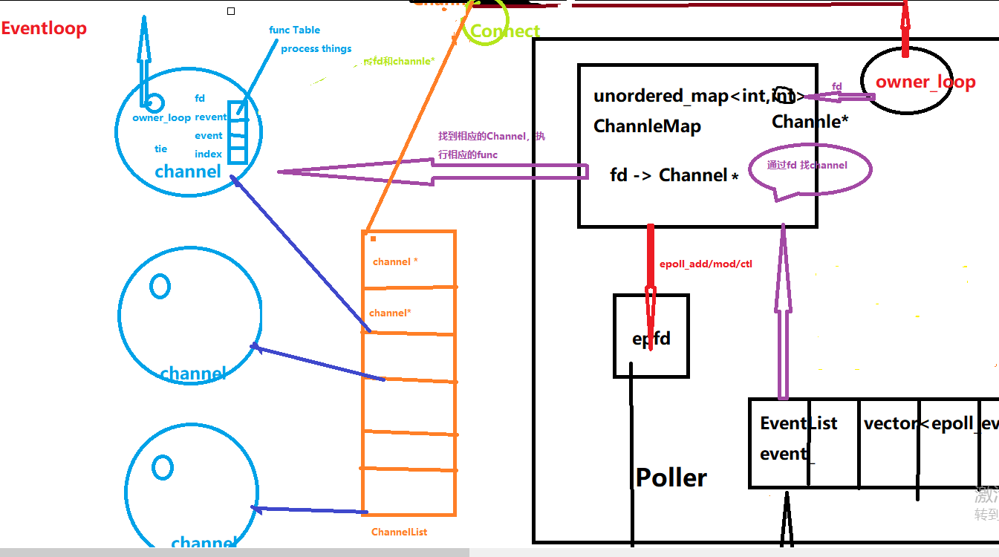
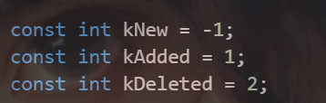

# 深入MUDUO库4：CHANNEL类与POLLER类

# Channel类

首先，我们认定Eventloop就是反应堆Reactor.

**（Eventloop属于Reactor，Channel属于Eventloop,Poller属于Eventloop）**,Eventloop就是封装的epoll。

Channel是通道类，它是**事件分发器**。它是muduo库负责注册读写事件的类，它保存了fd以及fd事件类型以及事件对应发生时调用的回调函数（方法/handler）。它虽然有fd，但是并不是拥有fd，它不负责关闭fd，因为它只是一个保存着这个fd相关事件，用户能通过在其上注册回调函数，由Channel来执行。

我们知道每当有一个新的cfd，那么它有一个感兴趣的事件，如果事件发生，它会做相应的操作。Channel就是完成当事件发生后，应该为fd回调某个函数，并且记录fd感兴趣的事件等（但是不记录操作的具体函数）。


事件分发器，分发给谁？分发给反应堆Reactor。Channel是在TcpConnection和epoll之间起沟通作用。反应堆反应完后会反应一个事件，这个事件会给CHANNEL，在整个过程，只有CHANNEL类知道fd发生的是什么事件，故最终由Channel处理对应操作。


**总结一下**：多核情况下，一个线程一个eventloop,  one loop per thread。一个loop里面有一个poller,一个poller监听很多channel。故一个channel属于一个eventloop,一个eventloop可以监听多个channel(故称为多路监听分发器)


```cpp
EventLoop *loop_;       //属于哪个分发器
const int fd_;          //负责的fd
int events_;            //感兴趣的事件
int revents_;           //实际发生的事件
int index_;				//for Poller

std::weak_ptr<void> tie_;  //目前未知
bool tied_;
```


Channel会根据Poller返回的事件进行调用处理函数(即事件处理在Channel类中)。

Channel包含fd+事件信息+回调接口

用户调用函数应该在Channel类上注册


##### 编程技巧

##### 1.传过来的形参对象若没有用可以使用move语句减小开销


cb是个左值，cb是个对象（默认认为比较大），如果直接readCallback_ =cb ,那么会调用readCallback的拷贝赋值函数，会将各种成员都进行拷贝过来，是一个比较耗时间的操作。但是如果使用readCallback_= std::move(cb)，因为cb这个参数不会再继续用到，那么只是直接将cb的指针赋给readCallback。是一个轻量级。       右值赋值是一个轻量级操作，只是转变指针。左值赋值是重量级操作，将各种成员变量都要COPY赋值。


##### 2.减少暴露头文件

**定义对象变量那么一定要确定大小，所以不能只是声明**，必须要包含头文件编译器才能找到其具体的大小。

定义对象指针只需要声明即可，因为指针是指针类


##### 3.weak_ptr 与 shared_ptr


##### 4.回调函数表



形参传递哪些？**# =  max{ *handler}**


# Polller类

分发器EPOLLER和POLLER的抽象类  Poller

主要功能是 启动循环事件并返回，更新channel,移除channel，判断是否有channel


##### 编程技巧

##### 1.头文件设计



抽象类的这个成员函数单独放在一个文件中实现，因为如果放在POLLER头文件中那么由于该成员函数是返回一个实例（EPOLL或POLLER）所以需要引入epoll或poller的头文件，那么会违背设计原则倒置依赖。所以需要放在一个单独的头文件中设计，不违背原则


# EPollPoller:public Poller类

EpollPoller是Poller的派生类，底层基于epoll实现。

EpollPoller与Channel是没有从属关系，他们之间是通过Eventloop来通信




Eventloop里面包含一个ChannelList  和一个 Polller . 一个Poller里面有一个ChannelMap  (unorderedmap<int ,Channel*>)。一个ChannleList里面向Poller注册，Poller就会保留其地址。 所以 ChannelList nums >=     ChannelMap nums (最坏情况下即全部注册)


放大主要的逻辑




很显然，这里的epoll_wait里面并没有业务逻辑。业务逻辑全部在channel里面。epoll_wait里面只处理IO。

每次epoll_wait里面返回的事件 不仅包括IO感兴趣的事件，还包括其他事件，比如一个cfd感兴趣收到消息，但是结果对端的fd断开连接，那么此时cfd收到了close事件，这个时候cfd的r_event的就是close事件。


一个Channle想改变自己感兴趣的事件，首先得自己update，其次要传达给Poller，而Channler和Polller是无法通信的，故需要Eventloop来做中间人，故Channel的update得调用Eventloop的update并将Channle传给它，Eventloop再调用Poller的update进行改变。


##### 详解1.三个状态



这三个状态用以在update中根据Channel的状态判断Channel是mod还是add或del.一个新的Channel是-1，即==kNew.

要注意在Map里面的kDelted Channel 虽然不在epfd里面但是仍然在ChannlMap里面

##### 详解2.pool的启动

```cpp
Timestamp EPollPoller::poll (int timeoutMs,ChannelList* activeChannels) 
```

这个是由Eventloop启动的，poll执行通过返回ChannelList* 给activeChannels，来让Eventloop知晓，最后由Eventloop将activeChannels列表去找各个Channel，然后通过各自的Channel开始调用对应的函数。


##### 技巧3：将vector里面的数组地址抽出来


epoll_wait第二个参数是一个数组地址，而我们的events是由vector存储的

​							


那么怎么让vector里面的数组提出来？

event.begin() 是一个迭代器， *event.begin()就是首元素的引用，`&*`event.begin()就是首元素的地址。


##### 为什么会扩容`vector<struct event>`?

扩容的唯一解释就是Channellist＞＝Channelmap，events的大小并不能代表所有监听的io数量，因为返回的是发生事件的channels，map里面可能存在没有发生事件但是正在监听即realnums＞＝activenums，用push的原因也是防止这次事件返回大于数组大小进行动态扩容。
