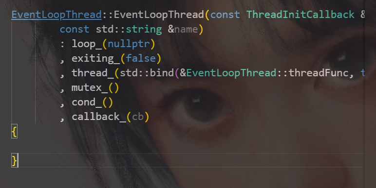
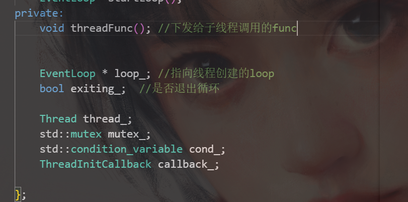
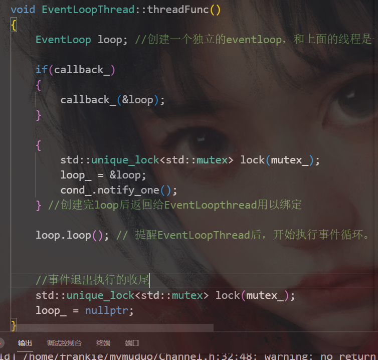
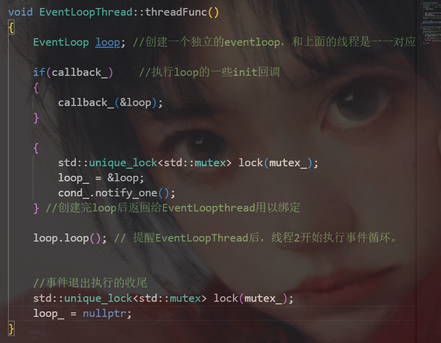

# EventLoopThread类

##### EventLoop与EventLoopThread的关系

EventLoopThread 显出了 one loop per thread . 创建一个新线程 去 创建新的loop 并绑定loop 与 所属线程的关系。

EventLoopThread 只有件两事：被调用启动一个新的线程与loop并将自己与该loop/线程绑定 ,回收线程结束loop。仅仅如此

EventLoopThread的职责就是绑定Loop和Thread.

首先threadFunc是EventLoopThread下发给子线程的在start里面要调用的func()

子线程创建流程：

看看这个func()的实现

从中我们可以看到：

EventLoopThread的作用就是绑定loop和thread的。

##### 我们再看看整个流程

##### 总体流程：

首先线程1和线程2是共享整个资源。线程1创建新线程2，线程1先进入start()，线程2创建成功通过sem信号给线程1，线程1从start()回来加锁和条件变量等待线程2创建完loop后要给的指针.线程2创建成功后，开始创建loop对象，同时调用线程1传给来的ThreadInitCallback类的Loop初始化函数，初始化成功后代表loop彻底创建成功，loop创建成功后通过cond_提醒线程1，线程1将loop指针赋值，然后返回loop给调用startloop()的调用者。而线程2则继续向下执行，执行loop.loop()即启动创建的loop的Poller开始监听。

其次线程2是存储在通过EventLoopThread里面的Thread类里面的thread_智能指针里面管理。（Thread类里面有一个智能指针thread__ 用以保存通过Thread::start()创建的子线程）

这也就是one loop per thread ，线程1通过创建新线程2去创建loop并执行poller的事件循环。 EventLoopThread记录着线程2和其对应的Loop，而调用EventLoopThread的线程1则返回给调用者（这也说明了线程是有归属）。这也就是EventLoopThread的绑定作用。

##### 如何将线程和LOOP绑定？

创建loop和线程时，通过每个loop绑定一个线程号threadId_.

