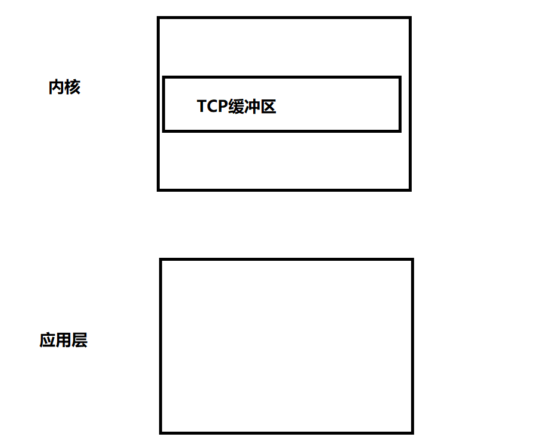

# 阻塞，非阻塞，同步，异步

#### 首先，我们只谈论网络IO文件


我们从一行代码进行出发

```c
int size = recv(sockfd,buf,1024,0);
```

在网络上，从对端上接收数据到自己的应用层，对应两个过程：

**1.网络IO阶段一  数据准备**

**2.网络IO阶段二  数据读写**

阻塞与非阻塞是相对网络IO阶段一的，同步与异步是相对网络IO阶段二的。



我们这样理解，网络阶段一是从对端上到系统内核缓冲区——TCP接收缓冲区。 网络阶段二是从内核缓冲区搬运到应用层buf。

故第一个阶段是数据准备（指准备到内核缓冲区中），第二个阶段是数据搬运（指从内核搬运到buf中）


#### 数据阶段1：数据准备

这个时候我们是等待数据从对端上到内核中的阶段。

```c
int size = recv(sockfd,buf,1024,0);
```

这个阶段中，比如一个服务器接收对端TCP报文到cfd中。我们就是要等待tcp报文的数据全部到cfd（sockfd）中去。

###### 阻塞

###### 非阻塞

这个时候如果cfd是阻塞的，那么当cfd没数据的时候，这个函数会阻塞当前流，如果cfd是非阻塞的，那么当cfd没数据的时候，这个函数会返回一个值代表一系列的情况

```cpp
1.size == -1  出错：对方关闭连接
2.size == -1 && error == EAGAIN 没有数据返回，没有网络事件
2.size == 0 对端关闭了连接   
3.size > 0    返回的数据长度；
```


#### 数据阶段2：数据读写

这个阶段，是tcp缓冲区（也即cfd)上有数据的时候，我们将tcp缓冲区的数据搬运到应用层的buf缓冲区这个阶段。


这个阶段是有同步与异步之分。

首先我们要理解我们所说的IO同步异步是在操作系统这个层面，而不是并发的同步和异步，并发的同步和异步是业务层面。


###### 同步

**这里如果是同步的话，那么从内核到应用层搬运数据的操作由我们自己完成，并且只有等到搬运完recv才能继续进行主线程流。这个时候应用程序要么空转要么在死等**


###### 异步

而如果是异步的话，我们就不能用recv来举例了，**因为recv是一个同步的接口**


这里如果是异步的话，那么应用层就告诉内核我对某个远端的数据感兴趣你把远端的数据获取到你的内核缓冲区，然后继续把内核缓冲区的数据发送到我的应用缓冲区buf里，缓冲ok后就通过**通知**我一下，在这期间我就去做其他事情了（执行其他流）。这就是异步。异步最大的特点就是**通知**。 


异步的通知可以通过信号signo，回调


#### 同步与异步

###### 数据的取出方式

同步是自己取tcp内核缓冲区到自己的buf缓冲区，异步是由内核完成从tcp内核缓冲区到自己的buf缓冲区且buf准备好了就通知应用程序。（所以异步IO高效，但是编程复杂）


### 总结

**陈硕大神原话：在处理 IO 的时候，阻塞和非阻塞都是同步 IO。只有使用了特殊的 API 才是异步IO。**

意思就是只有在自己处理IO的时候都是同步IO，只有用了特殊的API（aio_read/aio_write）比如让OS完成一切工作就叫特殊，这就叫做异步IO。

在处理的时候我们只处理同步IO，故阻塞与不阻塞的判断对同步IO有意义。虽然异步IO仍有阻塞和非阻塞之分但是异步阻塞是无意义的没必要的，我们要考虑阻塞与非阻塞只对于同步