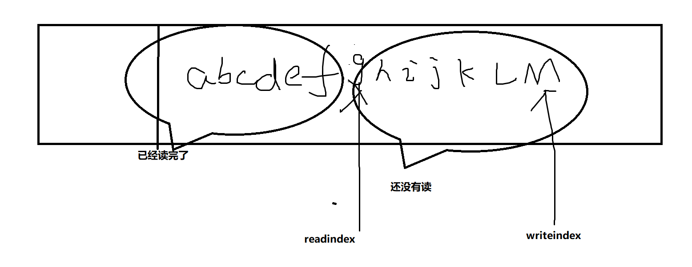

# 深入MUDUO具体分析：Buffer类


Buffer类刚开始有点绕，起始Buffer类注意以下几点就容易理解。


1.readerIndex_ 表示前面已经读完，下次从哪里开始读

2.writerIndex_ 表示前面已经写完，下次从哪里开始写

3.Buffer类是应用层的缓冲区，是由应用程序将数据写进buffer,然后将会把buffer写入内核，因为TCB缓冲区有限可能一次性没写完所以需要用Buffer类来记录以防数据丢失。   然后这里的Buffer里面的写writeindex并不是内核的write，而是应用层的write.


4.一定是先写入数据，后读数据，当readindex == writeindex说明readable==0 ,即数据已经读完。


5.在写的时候，需要判断后面的writeable()空间和前面读完的空间加起来是否大于len.若是就将read完的空间向后移动，未读的向前面移动

如图




前面的是用以解决粘包问题，可以在头八个字节放这一次解析包的长度。后面就是放数据


##### 技巧：内存碎片技巧

从fd上读取数据时，Poller工作在LT模式

Buffer缓冲区是在堆里，是有大小的，但是从fd

上读数据是不知道TCB缓冲区大小的，所以我们无法判断

Buffer容量是否足够，我们不知道TCB大小，

我们也不能一次性分配非常大的空间，如果太小会造成数据

丢失，那么我们如何去找刚刚适合的大小呢？

通过内存碎片函数即iovec


```cpp
ssize_t Buffer::readFd(int fd,int * saveError)
{
    char extrabuf[65536] = {0}; //栈上的内存空间 64K

    struct iovec vec[2];

    const size_t writable =writableBytes(); 

    vec[0].iov_base = begin() + writerIndex_;
    vec[0].iov_len = writable;

    vec[1].iov_base = extrabuf;
    vec[1].iov_len = sizeof extrabuf;


    const int iovcnt = (writable < sizeof extrabuf) ?2:1;
    const ssize_t n = ::readv(fd,vec,iovcnt);

    if(n < 0 )
    {
        *saveError = errno;
    }
    else if( n <= writable)
    {
        writerIndex_ += n;
    }
    else
    {
        writerIndex_ = buffer_.size();
        append(extrabuf,n-writable);
    }
    return n

}
```

即使用一个算法判断，如果算法为1 我们就用2个空间extrabuf && writable  如果为0  我们就用writable