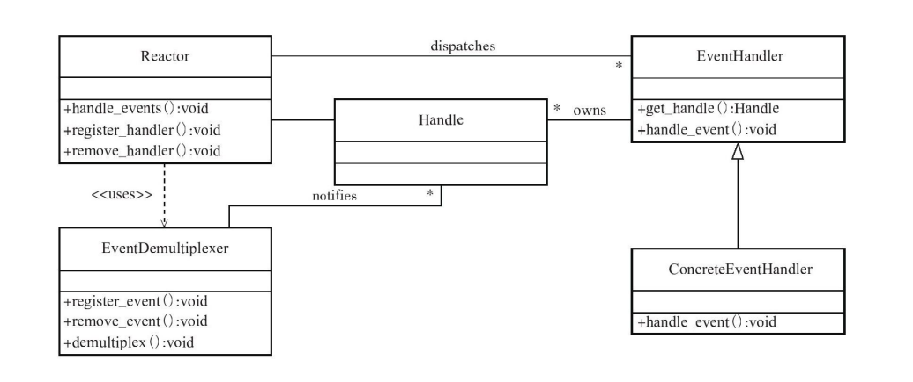
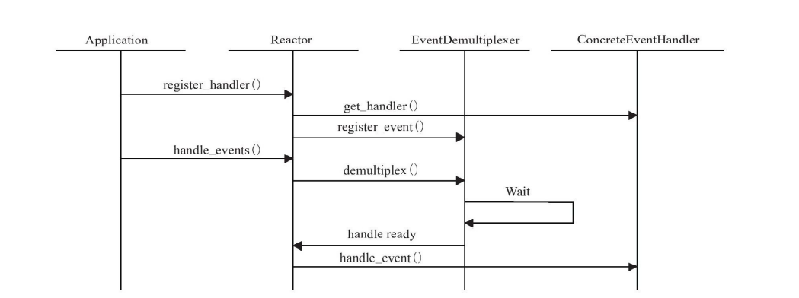

# Eventloop类

EventLoop即反应堆Reactor






首先每个EventLoop都对应一个线程，线程由线程名标识。

主反应堆有多路监听器（EPoller)和事件处理器（Channels)。而SubReactor是子Eventloop，它是Worker，它自己另开线程处理主Reactor分发过来的事件。  它很显然是由主Reactor唤醒。


##### Muduo库模型图

(LibEvent也是这样)


##### 那么主EventLoop怎么唤醒subReactor(subEventloop)的呢？

其内部实现了一个weakupChannel专用于通知subEventloop，其内部实现是用到了eventfd()系统调用


使用的是eventfd() 系统调用通知的，实现内部逻辑是一个计数器（待看）。

1. eventfd 和 [timerfd](https://link.zhihu.com/?target=http%3A//mp.weixin.qq.com/s%3F__biz%3DMzg2NDUyNjYyMg%3D%3D%26mid%3D2247484100%26idx%3D1%26sn%3D949cc4eb1d97925f95d1b3591df5e0fd%26chksm%3Dce694ab5f91ec3a323d0fc3d8b0eee79643d70e8e922867d5f513f9c42dd6c61ec8573a8cedf%26scene%3D21%23wechat_redirect) 一样，依赖于anon_inodefs的匿名文件系统，起到节省内存，代码复用的目的，因为既可以实现文件接口，又不用实现完整的inode功能。
2. eventfd 实现了 read/write 接口，其本质上就是一个计数器的实现。
3. 由于 eventfd 实现了 poll 的接口，因此其可以可epoll事件驱动相结合，实现事件的驱动管理。
4. 由于eventfd 一直可以进行写，因此监听可读事件才会更有意义。

每个subReactor监听一个wakeupChannel,mainReactor通过对应的wakeupChannel进行write操作，subReactor能够感知。


##### CurrentThread

```cpp
  extern __thread int t_cachedTid;
  extern __thread char t_tidString[32];
  extern __thread int t_tidStringLength;
  extern __thread const char* t_threadName;
```


一个进程中的全局变量，存放在`.data`段，即所有线程共享可以共享这些变量。

上述的变量都是全局变量。这些变量还用__thread修饰，实际上C++11提供的`thread_local`。


thread_local是一个关键字，它用来修饰变量，被它修饰的变量有以下特征：

1.它指示对象具有**线程静态存储周期**，这些变量（或说对象）在线程开始的时候被生成。每个线程有自己独立的对象，当线程结束时候，得到销毁。

这些全局变量还用`__thread`修饰，实际上C++11提供的`thread_local`，意思是这虽然是全局变量，但是会在每一个线程栈存储一份拷贝，这个线程对这个变量的更改，别的线程是看不到的，可以理解为线程内全局（thread_local）

```cpp
void CurrentThread::cacheTid()
{
  if (t_cachedTid == 0)
  {
    t_cachedTid = detail::gettid();
    t_tidStringLength = snprintf(t_tidString, sizeof t_tidString, "%5d ", t_cachedTid);
  }
}

```

`Thread.cc`中的gettid()

```cpp
pid_t gettid()
{
  return static_cast<pid_t>(::syscall(SYS_gettid));
}

```

因为tid的访问`syscall(SYS_gettid)`是一个系统调用，涉及用户空间和内核空间的切换，为了提高效率，第一次执行syscall(SYS_gettid)时就把当前线程的tid存储起来，后边如果再需要tid就从变量t_cachedTid获取


多线程指的是多个loop，每个 loop上执行的channel对应的回调同样是单个线程在执行。

IO线程主loop一般accpet一个fd，然后需要分发给subloop。这个回调由mainloop注册并写，然后由subloop来执行
