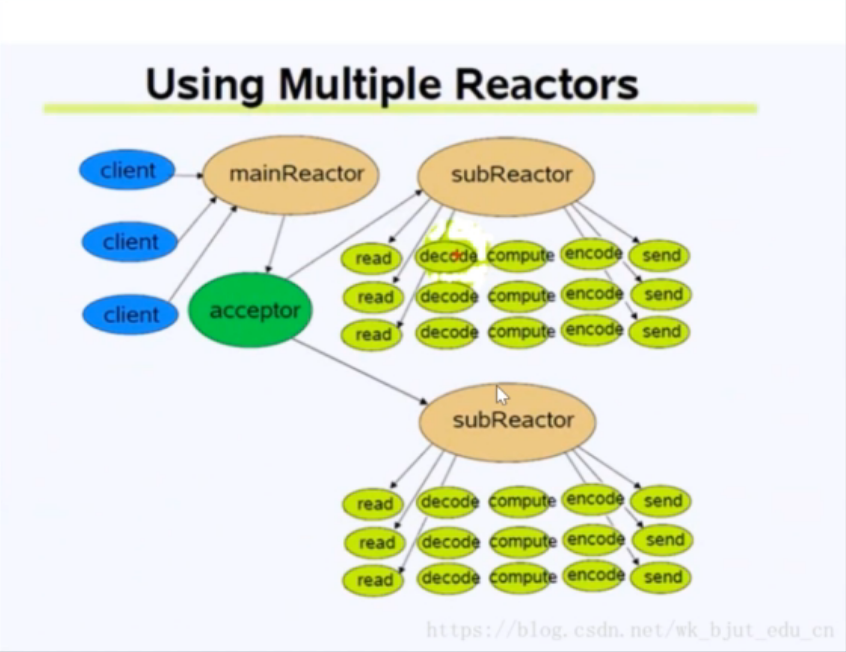
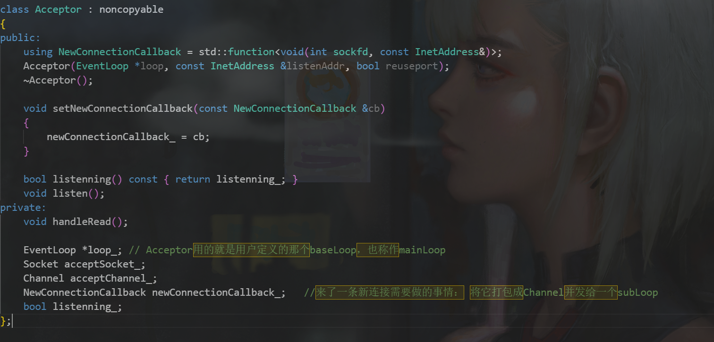
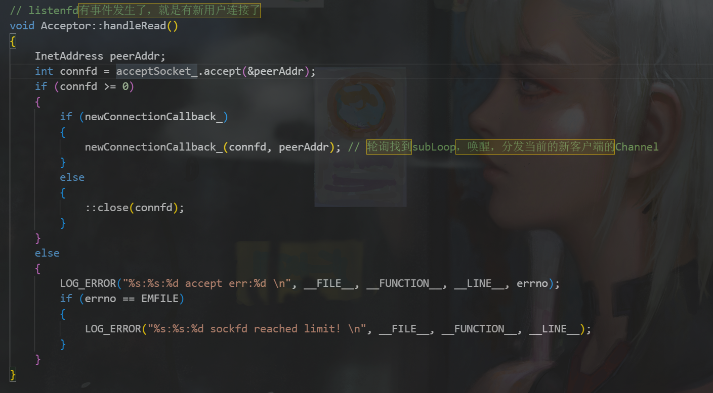

# 深入MUDUO库：Acceptor

Acceptor运行在baseLoop里面。baseLoop**能**通过Acceptor发送Channel给其他subLoop(分发器当然是Reactor里面的Poller，Poller返回连接事件给Reactor，Reactor再调用Acceptor，Accepotr做的事情就是选择一个subReactor管理新的Channel).

Acceptor是对listenfd的Channel进行封装。

Acceptor里面的实体对象只有Socket(lfd)，Channel{EventHandler}（lfd），还有一个来自TCPSERVER的回调newConnectionback_（此回调是表示三次握手连接后成功该做什么？核心是分发到subLoop）

Acceptor{lfd}是在baseLoop线程中的被监听的，故当lfd有读事件即有新连接到来，Acceptor必须做一些事情，这个事情就是handlRead()  总的来说就是 建立一个终端socketfd通信，建立成功后执行TCP发下来的回调newConnectionback_ (主要是分发新的cfd到subLoop上监听）   ，然而这个是Acceptor**提供的事情**，**而不是它能做的功能**，Acceptor本质是lfdChannel的封装，任何响应事件必须由Channel被**Poller的调度执行**，所以Acceptor提供的是给lfdChannel的回调，最后由baseloop的Poller调用lfdChannel的执行函数。

最后总结一下：

 Acceptor主要作用是分配Channle给哪个subloop监听，当然它自己封装的lfdChannel一定是在baseLoop中被监听的，它是一个事件处理器。  

为什么要封装lfdChannel?因为lfdChannel的确与普通的Channel不同，lfdChannel需要完成更多功能。

## TCPCONNECTION类

TcpConnection类是对cfd(Socket)和cfd event handler（Channel)的封装。TcpServer给TcpConnection的回调，服务端在cfd的发送数据，关闭连接，

Epoller监听Channnel，Channel是无法自己判断连接是否断了，它执行各种函数的时候也要判断连接是否断了。所以TcpConnection也维护了Channel是否应该继续在树上。 TcpConnection的ConnectEstablished能够把TcpConnection对象与Channel进行绑定。

若对端发生close连接，首先Poller检测到给到Channel，Channel执行对应的回调，然后会执行到TcpConnection::handleclose()来断开连接的回调，最后执行TcpServer传过来的closeCallback回调。

