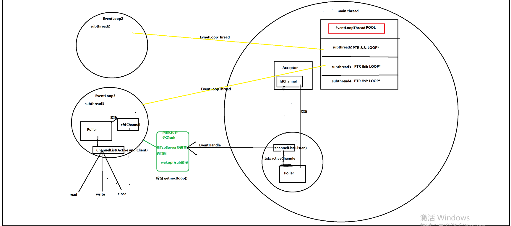
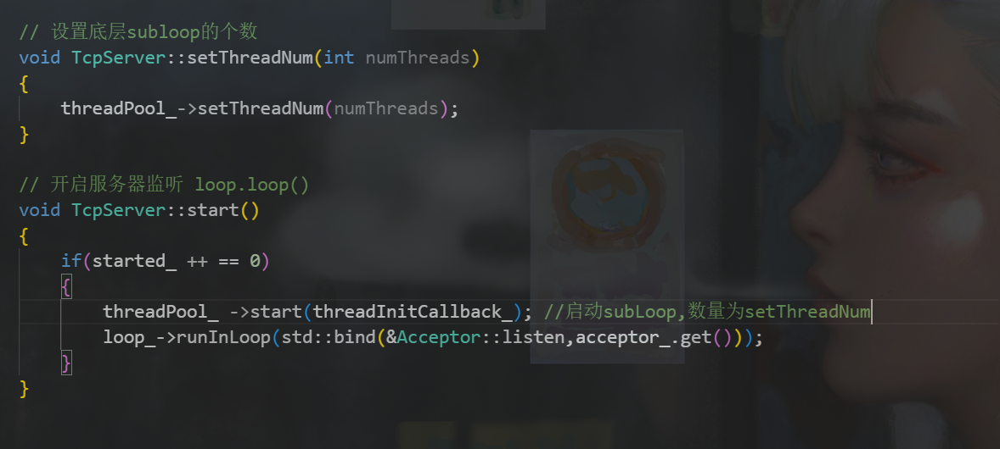
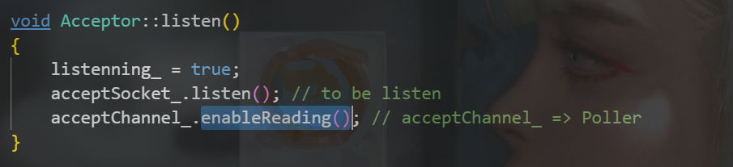

# 深入MUDUO具体分析：TcpServer类

TcpServer是一个容器类。并且起调度作用。

下图为适中详细的结构图

简化一点

##### 细说Reactor

首先，我以两种方式理解Reactor，一种是微观意义上定义静态的reactor(用小写代表微观的Reactor)，一种是宏观意义上的动态Reactor(大写表示)。     

上面这个图是将Reactor看作微观的reactor。实际上Reactor包括reactor+ do(EventHandler)

如上图所示的Reactor就是我所指的微观静态reactor,里面只是拥有很多注册的   “反应条目”，而宏观的Reactor就是运行中的反应堆，它不仅包括“反应条目”它还包括“当反应事件发生我是动态的我可以去执行对应的反应“ 。  

**所以Muduo库里面的任意一个Loop我可以看作是一个Reactor + Epoller**

当然一个Reactor包括很多组件，比如Muduo库里面的Channel，Acceptor等均是系统内的组件。

Reactor就像一个自运转系统，配合Demultiplex(Poller)达到 ” 监听并察觉反应物是谁（Demultiplex)  +    将察觉到的反应物执行对应反应（Reactor)". 

##### TcpServer是一个调度器

TcpServer构造时首先构造baseLoop,其次构造Accptor分配器（用以将lfd监听来的cfd发放个subLoop)，再构造EventLoopThreadPool（用以维护所有的subLoop && subthread的池式结构)

TcpServer构造时给Accpetor传一个回调，该回调作用是当有一个新连接时Accpetor该去选择分配给哪个subloop)

##### 当TcpServer开始服务器监听时要做什么？

初始化EventLoopThreadPool，并传递给它一个初始化的回调。

启动Thread。

其次调用Accptor的初始化即在自己baseLoop中执行一个回调&Acceptor::listen 

可知将lfdChannel启动并上baseLoop的监听器中。

